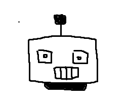
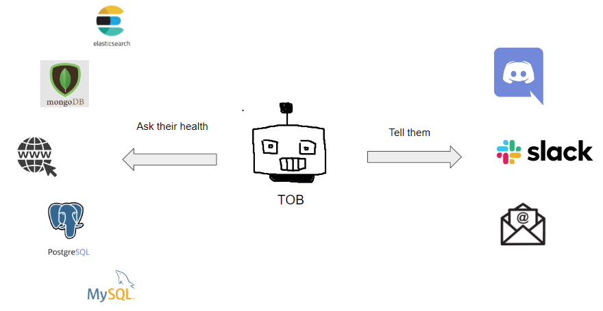

<div align="center">

[](https://github.com/telkomdev/tob)
<h3>Tob => Bot</h3>
A Notification Bot written in Go
</div>

### Architecture

[](https://github.com/telkomdev/tob)

### Getting Started

Build and Running
```shell
$ make build
```

`tob` options
```shell
$ ./tob -h
```

Running `tob` with config file
```shell
$ ./tob -c config.json
```

### TODO

- add Kafka service